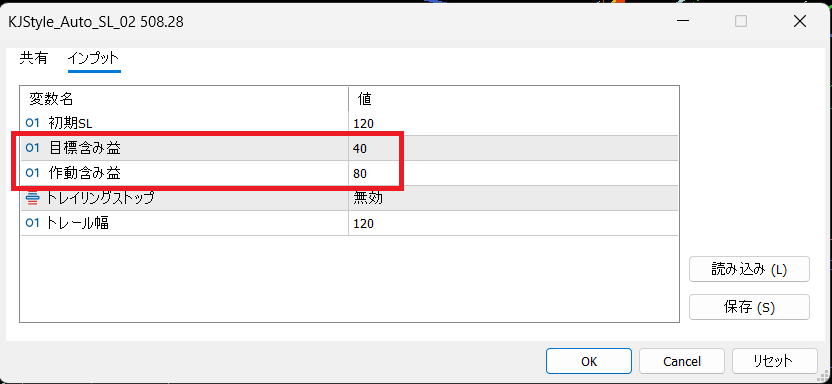

<small>ver2025.09.23</small>
# KJStyle_Auto_SLの使い方

KJStyle_Auto_SLは自動でSL（ストップロス、損切ライン）を設定するEAです。  
サロンでは「半自動EA」と呼ばれています。

エントリー時には必ずSLを設定することが推奨されていますが手動でのエントリーでは忘れてしまうことがあります。  
このEAを使うとエントリー直後に自動でSLが設定されます。

更に、エントリー後に狙った方向に価格が動き、含み益が出ると自動でSLを引き上げます。

オプションでトレーリンクストップ機能も使えます。

## パラメータを設定する

EAのインストール方法については下記のリンクからマニュアルをダウンロードしてください。  
[EAのインストール.pdf](https://drive.google.com/file/d/1KfLLh5kct4JTfWOdLxude2NyYWZjBcEJ/view?usp=drive_link)

EAをインストールしてチャートに設定すると、チャートの右上隅にEAの名前と帽子のアイコンが表示されます。  

EAの名前の右端にある帽子のアイコンをダブルクリックします。

「インプット」をクリックします。

ここで各種パラメータの設定ができます。  
設定が完了したら「OK」ボタンをクリックして適用します。

## 初期SL

ロング、又はショートエントリーした直後に自動でSLが設定されます。  
一番最初に設定されるSLの値を指定できます。  

初期値は「120」です。

**単位はポイントです。pipsではないので注意してください。**  

ポイントはお使いのFX業者によって変わるので合わせて調整してください。  
TitanFXの場合は「**120**」が「**12pips**」になります。

このマニュアルではTitanFXを前提に説明します。

## 目標含み益、作動含み益

「目標含み益」の初期値は「40」  
「作動含み益」の初期値は「80」です。

ロングでエントリーした後に価格が上昇したとします。  
含み益がある状態になります。  
含み益が8pips（作動含み益）に達すると、含み益が4pips（目標含み益）のラインに自動でSLを引き上げます。

このパラメータはエントリー後に狙った方向に価格が動いた場合にのみ関係します。  
反対方向に価格が動いた場合は初期SLで指定したSLで損切されます。

ある程度含み益が出ると自動でSLを引き上げるのでトレードを微益で終わらせやすくなります。

## トレイリングストップ、トレール幅

「トレイリングストップ」の初期値は「無効」  
「トレール幅」の初期値は「120」  
です。

「トレイリングストップ」を「有効」にすることで作動するようになります。  
デフォルトでは作動しませんので注意してください。

トレーリングストップは、目標含み益、作動含み益でのSL引き上げと同じような機能です。  
目標含み益、作動含み益は1回しか作動しませんがトレーリングストップは継続的に作動します。

ロングでエントリーした後に価格が上昇したとします。  
含み益がある状態になります。  
含み益が8pips（作動含み益）に達すると、含み益が4pips（目標含み益）のラインに自動でSLを引き上げます。

ここまでは「目標含み益」、「作動含み益」の動作です。

この後さらに価格が上昇して含み益が16pips(目標含み益:4pips + トレール幅:12pips)に達するとトレイリングストップが作動します。

含み益が25pipsに達するとSLが含み益13pips(含み益25pips - トレール幅12pips)の位置、26pipsに到達すると含み益14pips(含み益26pips - トレール幅12pips)の位置にSLが自動的に引き上げられます。  

価格が上がり続ける限りSLが追従して上がります。  
逆に価格が下がった場合にはSLは動きません。

大きく価格が上昇する場面であっても一時的には下げながら上がっていきます。  
一時的な下げが12pipsに収まれば損切に引っかかることなくその後の上昇に追従することができます。

トレイリングストップを有効にし、トレール幅を適切に設定することによって、損失を限定しながら利益を伸ばすことができるようになります。

## デモ

KJStyle_Auto_SLが動作しているデモ動画です。   
下記のリンクをクリックしてください。   
[KJStyle_Auto_SL_live_demo.mp4](https://drive.google.com/file/d/1pwd7kaGDSrCagV_cE4NGCHaIJKZ-v9j_/view?usp=drive_link)

1. 乖離幅をこえて矢印が出たところでロング方向にエントリー。
2. エントリーと同時にSLが-120(含み損12pips)の箇所に自動で設定。
3. その後狙い通り価格が上昇し、動画の00:09秒付近で含み益が8pipsを超える。
4. 「作動含み益: 80」に到達したことにより、SLが「目標含み益: 40」の位置に自動で引き上げられる。ここまでがトレーリングストップ機能を使わない従来までの半自動EAの動作。
6. 動画の00:17秒付近の急な伸びで含み益が16pips(目標含み益:40 + トレール幅:120)を超えトレーリングストップが作動。一気に含み益24pips付近まで到達してSLが12pipsに引き上げられる。
7. 利益方向の価格の伸びにSLが追従し、含み益が25pipsの場合はSLが含み益13pips(含み益25pips - トレイル幅12pips)の位置、26pipsに到達すると含み益14pips(含み益26pips - トレイル幅12pips)の位置にSLが自動的に引き上げられる 。
8. 価格が上がり続ける限りトレール幅を保ちつつSLが上がり続ける
9. 動画の00:25付近、価格が下がり始めるがSLはトレール幅を保ったままで引き下げられることはない。
10. トレール幅の12pipsという余裕を持たせた範囲の内で下げては上げを繰り返し少しずつSLが引き上げられる。
11. 最後に動画の00:50付近でSLに引っかかって決済