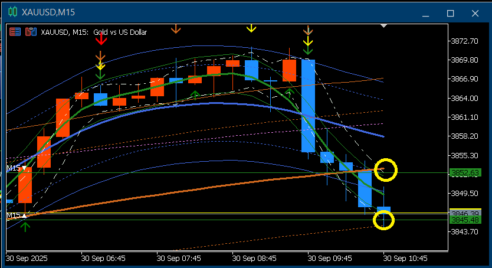
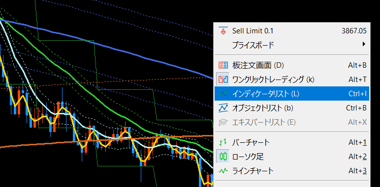
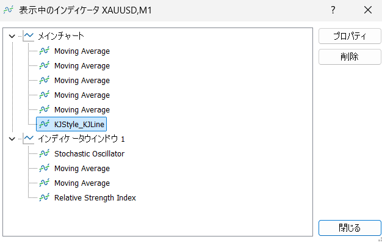
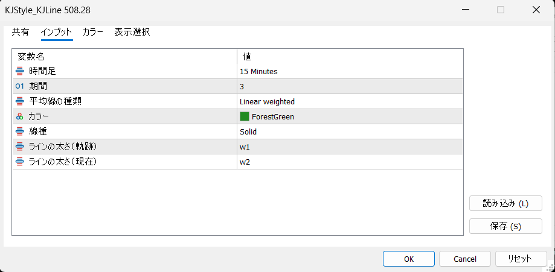
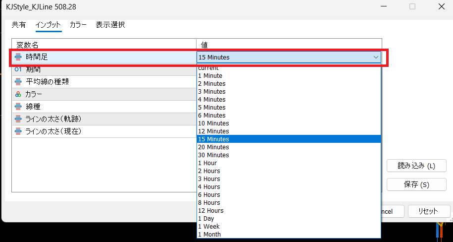
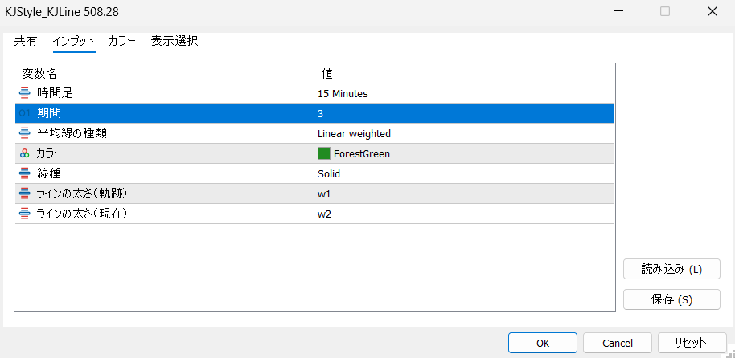
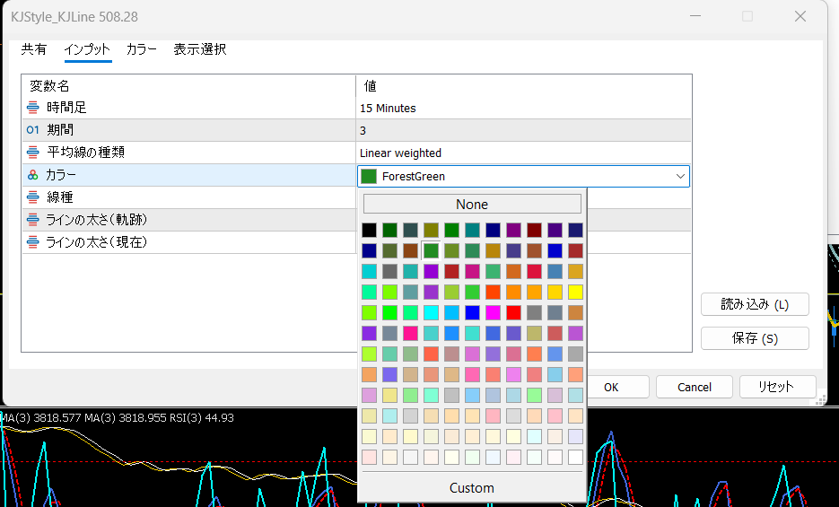
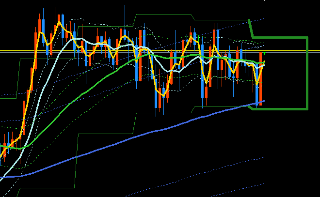

# KJStyle_KJLineの使い方

KJStyle_KJLineはKJLineを表示するインジケータです。

インジケーターのインストール方法については下記のリンクからマニュアルをダウンロードしてください。  
[インジケータのインストール.pdf](https://drive.google.com/file/d/1yxkSMk3CoZ3LU4uasFNktPeCrb-d3Up6/view?usp=drive_link)

## KJLineとは？

移動平均線の最新の値（最後の点）を、横にまっすぐ線を引いたもの  
のことをいいます。

KJLine High はローソク足の**高値**の移動平均線(MA)の最新の値  
KJLine Low はローソク足の**安値**の移動平均線(MA)の最新の値  
です。

以下このマニュアルでは簡単のため  
KJLine High を **KJLineH**  
KJLine Low を **KJLineL**  
と呼びます。

KJLineHとKJLineLの幅のことを **価格幅** といいます。

## KJLineの軌跡

15分足チャートにはKJLineが移動平均線の形で表示されています。  
白い点線がKJLineの軌跡です。  
最新の値に水平線を引いたものがKJLineです。

15分足チャートでは15分の切り替えタイミングでチャートに新しいローソク足が追加されます。  
新しいローソク足が追加されると移動平均線の最新の値、つまりKJLineが更新されます。  

このほかにも急な値動きがあった場合はKJLineが押し上げ、または、押し下げられて更新さることがあります。

M15KJLineは15分に一回更新されます。  
これを1分足チャートに表示すると階段状の線になります。

## パラメータの設定

1. KJStyle_KJLineが設定されているチャートを表示する
2. チャート上のどこでもよいので何もない黒い部分をクリック
3. コンテキストメニューから「インディケーターリスト」
4. 「KJStyle_KJLine」を選択して「プロパティ」ボタンをクリック
5. 設定が完了したら「OK」ボタンをクリックして適用します

*3.*   
*4.*   
*5.* 

## 時間足

KJLineの時間足を設定します。  
値をダブルクリックすると選択肢が表示されます。  
M15KJLineを表示したい場合は「15 Minutes」、H1KJLineを表示したい場合は「1 Hours」を選択してください。

※ チャートに異なる時間足の複数のKJLineを設定したい場合はインジケータを複数設定する必要があります。(1分足チャートにD1,H12,H4,H1,M15のKJLineを表示したい場合は5つのKJStyle_KJLineを設定する必要があります。)

※ 1時間足チャートに「15 Minutes」を設定することは出来ません。階段状の線で表示したい場合、1時間足チャートであれば「4 Hours」以上、4時間足チャートであれば「12 Hours」以上を設定してください。

※ 15分足チャートに「15 Minutes」のようにチャートの時間足と同じ時間足を設定すると階段状の線ではなく移動平均線(MA)のように表示されます。

## 期間

移動平均線（MA）の期間を設定します。  
「**3期間**」の場合は「**3**」  
「**4期間**」の場合は「**4**」  
を設定してください。

## 平均線の種類

デフォルトは「Linear weighted」が選択されています。  
サロンのロジックでは「Linear weighted」を使用します。  
設定を変更する必要はありません。

## カラー

線の色を指定します。  
配布されているテンプレートで使われている各時間足のKJLineの色は以下の通りです。  
設定の参考にしてください。  
カラーピッカーで選択することもできますが、色名を直接テキストで入力することもできます。

|時間足|カラー|カラー（第2候補）|
|----|----|----|
|1 Day (日足,D1) |Crimson||
|12 Hours (12時間足,H12) |Violet|PaleVioletRed|
|4 Hours (4時間足,H4)|Chocolate|DarkOrange|
|1 Hours (1時間足,H1)|RoyalBlue||
|15 Minutes (15分足,M15)|Teal|ForestGreen|

## 線種

線の種類を設定できます。  
デフォルトは「Solid (実線)」です。  
他に「Dash (破線)」、「Dot (点線)」などが選択できます。  
デフォルト設定のまま使用する事をお勧めします。

## ラインの太さ (軌跡)

KJLineの軌跡（過去のKJLine）の太さを調整できます。  
「**w1**」が一番細く、「**w5**」が一番太い線になります。

## ラインの太さ (現在)

軌跡ではなく現在有効なKJLineのみ太さを変えて強調することができます。
「**w1**」が一番細く、「**w5**」が一番太い線になります。

下記は軌跡を「**w1**」、現在のKJLineを「**w5**」という一番太い線にしたときの見た目です。

## 応用編
KJLineは主に抜け戻りで方向性を見るために使用するものですが、
KJStyle_KJLineを使うとできる応用的な使い方を紹介します。

### 1分足チャートで15分切り替えタイミングを見る

### 15分切り替え時のKJLine抜け戻り、プライスアクションを判定する

エントリーの根拠としてM15KJLineの抜け戻りとプライスアクション（バンドの外でローソク足の色変わり）があります。

これらを15分足で確認することが多いと思います。

15分の切り替えを跨いで起こることがあります。

### 価格幅の移動の確認

M15の価格幅が大きく下に移動するのが続いている場合は、M15チャートで見ると陰線が連続で出ている時です。  
安値を更新し続けているような場合に出現します。  

安値、高値を更新している場合はトレンド方向への勢いが強く、すぐに戻されることが多いため短期意識でのエントリーを考える必要があります。

軌跡を見てバンド付近で価格幅の移動が少なくなってきた場合には下げ止まり、上げ止まりと判断できます。  

上げ上げ、下げ下げ相場の時は、上げ止まり、下げ止まりを確認してからの方が入りやすいのでKJLineの軌跡がその目安となります。

### 価格幅の広さの確認

価格幅が広い場合は値動きが大きい
価格幅が狭い場合は値動きが小さい（狭いレンジ）
と判断できます。

例えば、バンド幅と価格幅が同じ大きさであれば大きなレンジの上下を取る、というように狙いを定めるために使用できます。