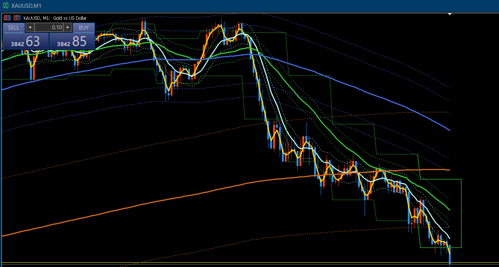

# KJStyle_KJLineの使い方

KJStyle_KJLineはKJLineを表示するインジケータです。

## KJLineとは？

移動平均線の最新の値（最後の点）を、横にまっすぐ線を引いたもの  
のことをいいます。

KJLine High はローソク足の高値の移動平均線(MA)の最新の値  
KJLine Low はローソク足の安値の移動平均線(MA)の最新の値  
です。

以下このマニュアルでは簡単のため  
KJLine High を **KJLineH**  
KJLine Low を **KJLineL**  
と呼びます。

KJLineHとKJLineLの幅のことを **価格幅** といいます。

## KJLineの軌跡

15分足チャートにはKJLineが移動平均線の形で表示されています。  
白い点線がKJLineの軌跡です。  
最新の値に水平線を引いたものがKJLineです。

15分足チャートでは15分の切り替えタイミングでチャートに新しいローソク足が追加されます。  
新しいローソク足が追加されると移動平均線の最新の値、つまりKJLineが更新されます。  

このほかにも急な値動きがあった場合はKJLineが押し上げ、または、押し下げられて更新さることがあります。

M15KJLineは15分に一回更新されます。  
これを1分足チャートに表示すると階段状の線になります。

## パラメータの設定

インジケーターのインストール方法については下記のリンクからマニュアルをダウンロードしてください。  
[インジケータのインストール.pdf](https://drive.google.com/file/d/1yxkSMk3CoZ3LU4uasFNktPeCrb-d3Up6/view?usp=drive_link)

1. KJStyle_KJLineが設定されているチャートを表示する
2. チャート上のどこでもよいので何もない黒い部分をクリック
3. コンテキストメニューから「インディケーターリスト」
4. 「KJStyle_KJLine」を選択して「プロパティ」ボタンをクリック
5. 設定が完了したら「OK」ボタンをクリックして適用します

*3.* 
*4.* 
*5.* 

「インプット」をクリックします。

## 時間足

KJLineの時間足を設定します。  
値をダブルクリックすると選択肢が表示されます。  
M15KJLineを表示したい場合は「15 Minutes」、H1KJLineを表示したい場合は「1 Hours」を選択してください。

※ チャートに異なる時間足の複数のKJLineを設定したい場合はインジケータを複数設定する必要があります。(1分足チャートにD1,H12,H4,H1,M15のKJLineを表示したい場合は5つのKJStyle_KJLineを設定する必要があります。)

※ 1時間足チャートに「15 Minutes」を設定することは出来ません。階段状の線で表示したい場合、1時間足チャートであれば「4 Hours」以上、4時間足チャートであれば「12 Hours」以上を設定してください。

※ 15分足チャートに「15 Minutes」のようにチャートの時間足と同じ時間足を設定すると階段状の線ではなく移動平均線(MA)のように表示されます。

## 期間

移動平均線（MA）の期間を設定します。  
「3期間」の場合は「3」  
「4期間」の場合は「4」
を設定してください。

## 平均線の種類

このサロンでは「Linear weighted」を使用します。  
設定を変更する必要はありません。

## カラー

線の色を指定します。  
テンプレートで設定されている各時間足のKJLineの色は以下の通りです。

|時間足|カラー|
|----|----|
|1 Day (日足,D1) |Crimson|
|12 Hours (12時間足,H12) |Violet (PaleVioletRed)|
|4 Hours (4時間足,H4)|Chocolate (DarkOrange)|
|1 Hours (1時間足,H1)|RoyalBlue|
|15 Minutes (15分足,M15)|Teal (ForestGreen)|

## 線種

線の種類を設定できます。  
デフォルトは「Solid (実線)」です。  
他に「Dash (破線)」、「Dot (点線)」などが選択できます。

## ラインの太さ (軌跡)

## ラインの太さ (現在)

## 使い方
###  1分足チャートで15分切り替えを確認する
### 価格幅の上下移動の遷移
### 価格幅の上下の広さの遷移
