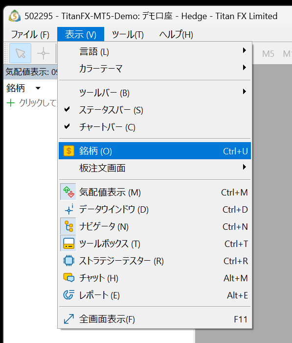
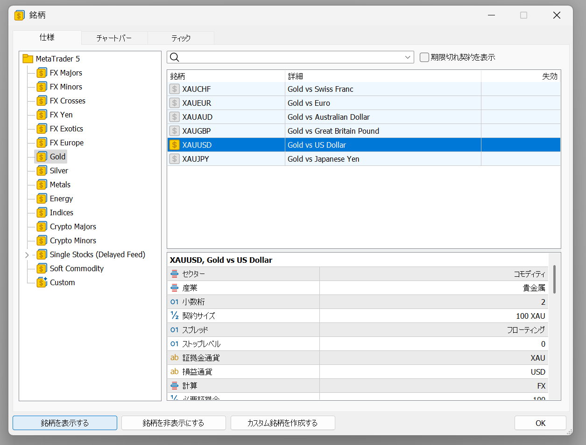
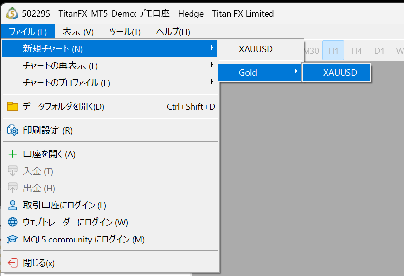
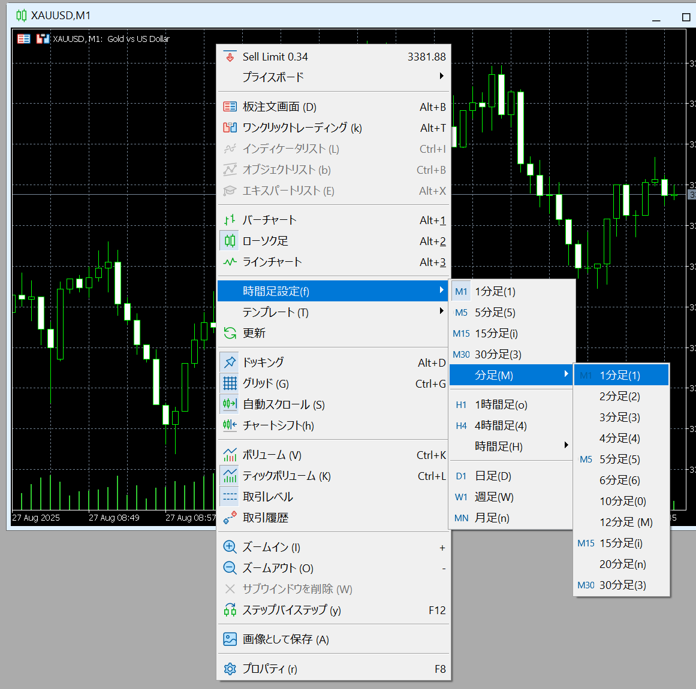
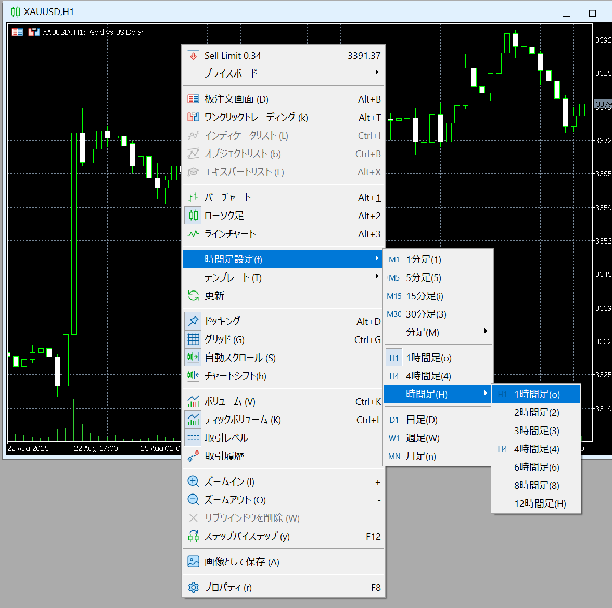
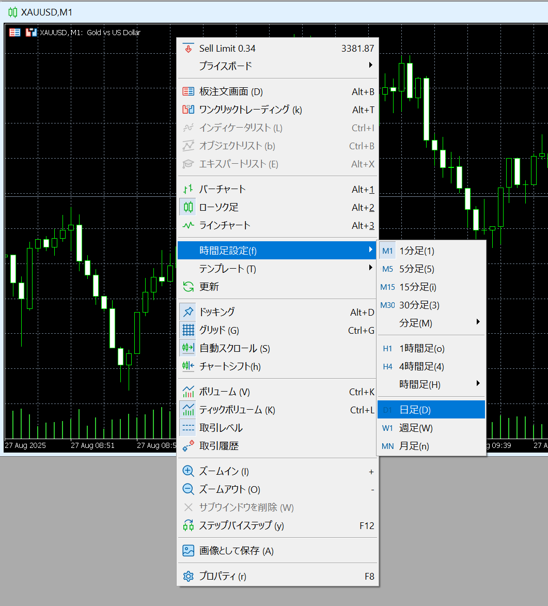
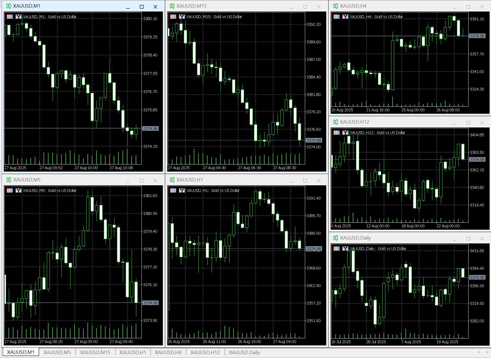
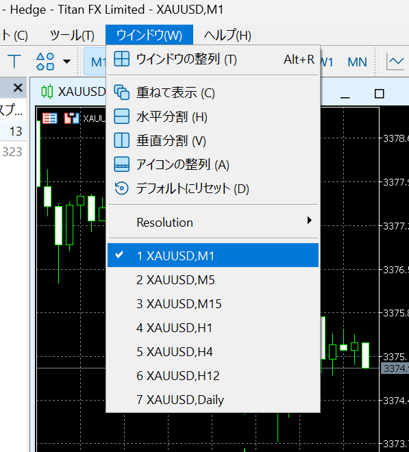

<small>ver2025.08.28</small>
# 新規チャートの作成

新しくGOLDのチャートを作成する手順を説明します。

## 手順1. 銘柄にGold(XAUUSD)を表示する
1. メニューから「表示」＞「銘柄」
2. 左ペインよりGoldをクリック
3. 右上ペインよりXAUUSDをクリック
4. ウィンドウ下部の「銘柄を表示する」ボタンをクリック

## 手順2. 新規チャートを作成する
1. メニューから「ファイル」＞「新規チャート」＞「Gold」＞「XAUUSD」

## 手順3. チャートに時間足を設定する

1. チャート上の何もない黒い部分を右クリック
2. 「時間足設定(f)」＞「分足(M)」＞「1分足(1)」

上記は1分足を設定する場合です。
その他の時間足を設定する場合は下記に読み替えてください。

### その他の時間足

- 1分足
    - 「時間足設定(f)」＞「分足(M)」＞「1分足(1)」 
- 5分足
    - 「時間足設定(f)」＞「分足(M)」＞「5分足(5)」 
- 15分足
    - 「時間足設定(f)」＞「分足(M)」＞「15分足(15)」 

- 1時間足
    - 「時間足設定(f)」＞「時間足(H)」＞「1時間足(o)」 
- 4時間足
    - 「時間足設定(f)」＞「時間足 (M)」＞「4時間足 (4)」 
- 12時間足
    - 「時間足設定(f)」＞「時間足 (M)」＞「12時間足(12)」 

- 日足
    - 「時間足設定(f)」＞「日足(D)」 

## 手順4. 時間足毎に新規チャートを作成して時間足を設定する 

新規チャートを作成しチャートに時間足を設定する手順を繰り返します。
1分足、5分足、15分足、1時間足、4時間足、12時間足、日足の7つのチャートを表示します。

## 手順5. 7つの異なる時間足のチャートがあることを確認する

1. メニューから「ウィンドウ」
2. 次の7つが表示されていることを確認する
    - 「XAUUSD,M1」
    - 「XAUUSD,M5」 
    - 「XAUUSD,M15」 
    - 「XAUUSD,H1」 
    - 「XAUUSD,H4」 
    - 「XAUUSD,H12」 
    - 「XAUUSD,Daily」 

