# EAのインストール

EAのインストール方法を説明します。

- 注意. このマニュアルはWindows11ユーザーが対象です。
    - Windows10ユーザーはダウンロードフォルダの開き方が異なります。それ以外は同じように使えます。
- 注意. このマニュアルはMacユーザーには対応していません。
- 注意. このマニュアルでは例として「KJStyle_Auto_SL_02.ex5」のインストールを行います。 
    - 他のEAのインストールは「KJStyle_Auto_SL_02.ex5」の部分を読み替えれば同じように使えます。

## 手順1. ダウンロードフォルダを開く
1. 全てのアプリケーションとウィンドを閉じる
1. タスクバーの「エクスプローラー」をクリック
1. 左ペインの「ダウンロード」をクリック
1. 「KJStyle_Auto_SL_02.ex5」があることを確認
1. ファイル名の先頭のアイコンを見てzipファイルであることを確認
    - ファスナーが付いているフォルダのアイコンです。

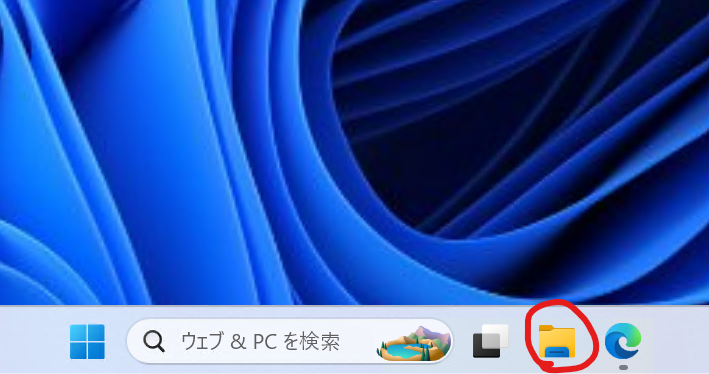
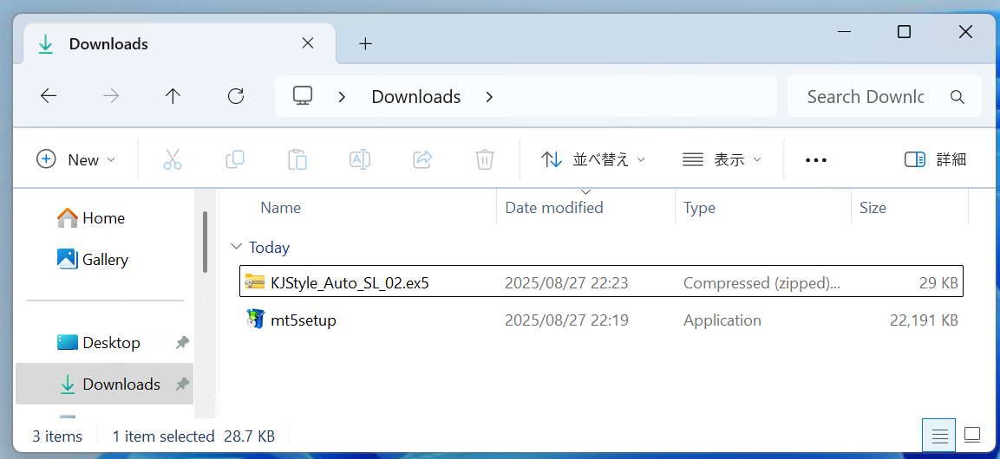
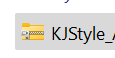

## 手順2. ダウンロードしたzipファイルを開く（解凍する）
1. ファイルの更新日時が新しいことを確認する
    - 古いファイルがダウンロードフォルダにある場合、新しいファイルが「KJStyle_Auto_SL_02.ex5 (1)」のような名前で保存されます。新しい方が対象です。
1. ダウンロードしたファイルをダブルクリック
1. フォルダの中に「KJStyle_Auto_SL_02」があることを確認
1. ファイル名の先頭のアイコンを見てEAファイルであることを確認
    - 歯車とチェックマークが組み合わさったようなアイコンです。

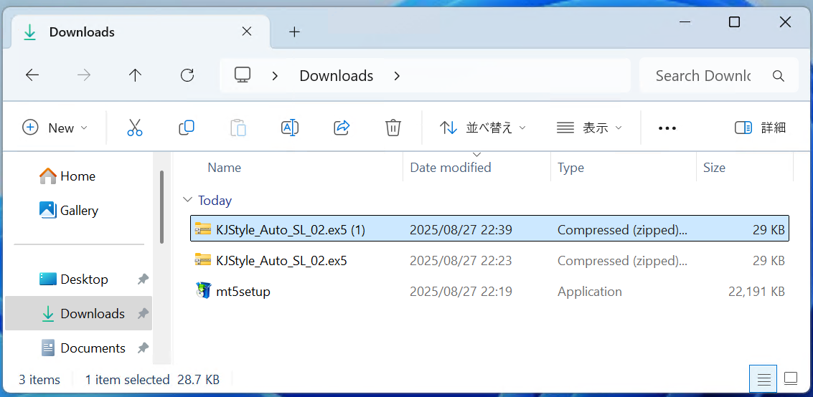
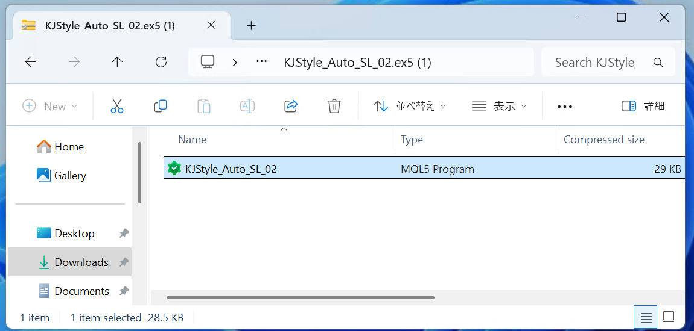
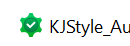

## 手順3. MT5のEAフォルダを開く
1. MT5を起動する
1. メニューから「ファイル(F)」＞「データフォルダを開く(D)」
1. 次の順にフォルダを開く「MQL5」＞「Experts」＞「Examples」

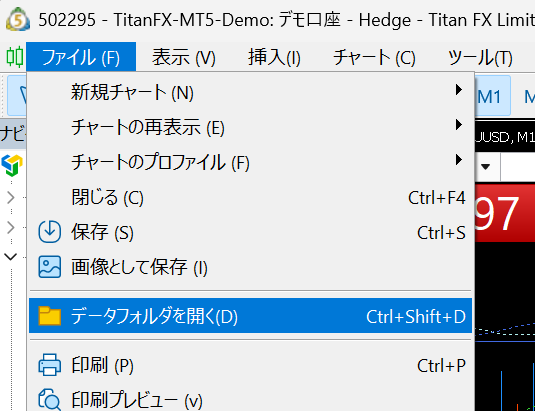

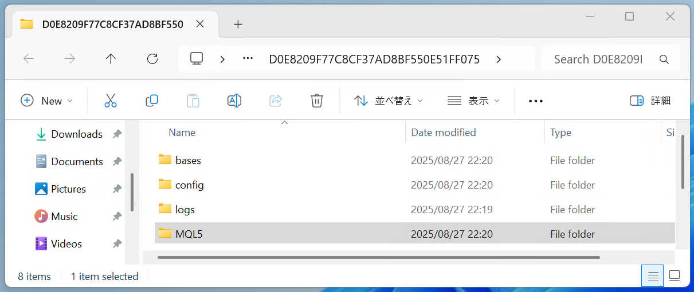
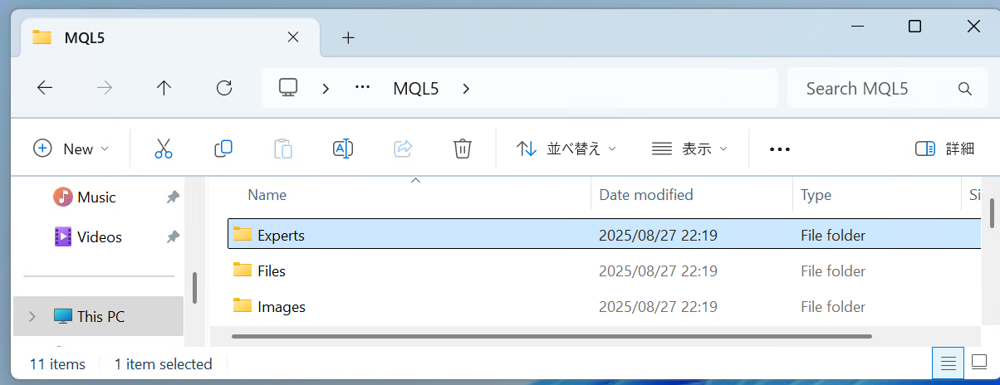 
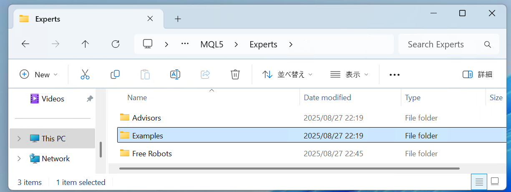

## 手順4. EAファイルをEAフォルダにコピーする
1. 手順2.で開いたフォルダを左に、手順3.で開いたフォルダを右にして並べる
1. 左のフォルダの「KJStyle_Auto_SL_02」をドラッグして右のフォルダにドロップする

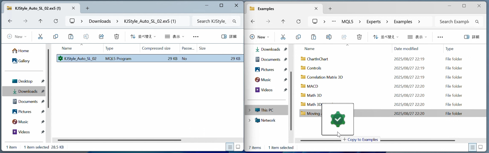

## 手順5. MT5を再起動する
1. MT5を終了する
1. MT5を起動する

## 手順6. ナビゲータを表示
1. メニューから「表示」＞「ナビゲータ」
1. 左ペインに表示されたナビゲータから「エキスパートアドバイザ(EA)」＞「Examples」
1. 「KJStyle_Auto_SL_02」があることを確認

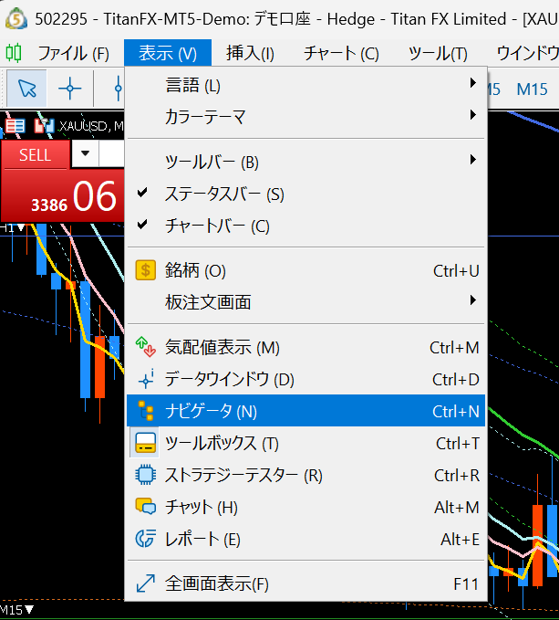
 
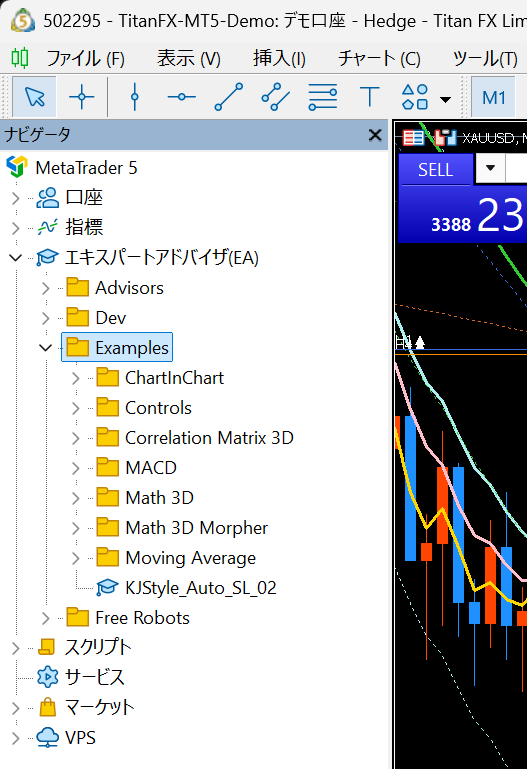

## 手順7. EAをチャートに設定
1. 1分足チャートを前面に表示（メニューから「ウィンドウ」＞「XAUUSD,M1」）
1. ナビゲータにある「KJStyle_Auto_SL_02」をドラッグして、1分足チャートウィンドウにドロップ
1. 表示されたダイアログの下部にある「アルゴリズム取引を許可」をチェックして「OK」ボタンをクリック

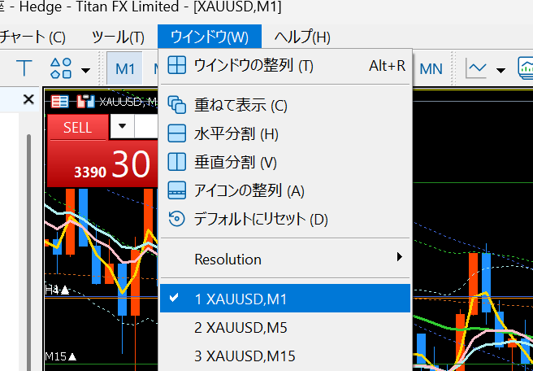
 
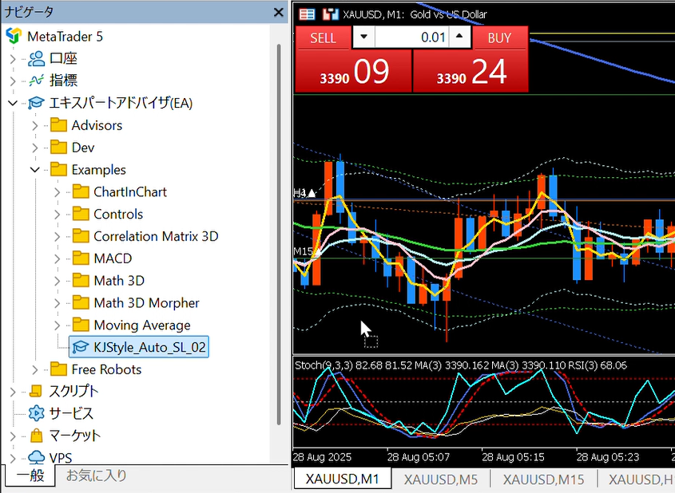

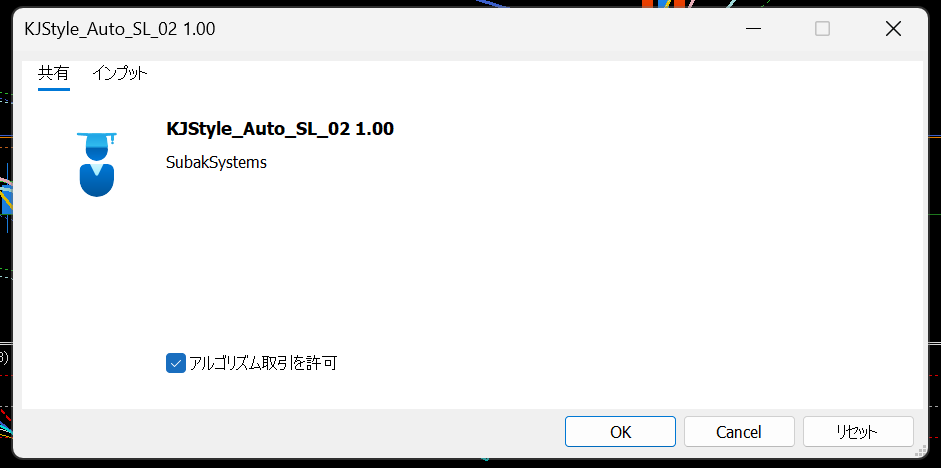

## 手順8. アルゴリズム取引を許可
1. メニューから「ツール」＞「オプション」
1. 表示されたダイアログの「エクスパートアドバイザ」タブをクリック
1. 「アルゴリズム取引を許可」をチェックして「OK」ボタンをクリック

ツールバーにある「アルゴリズム取引」ボタンでも、アルゴリズム取引を許可または禁止、の切り替えができます。

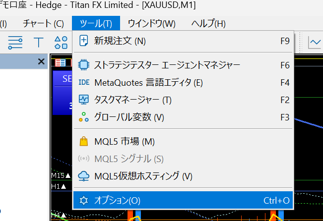
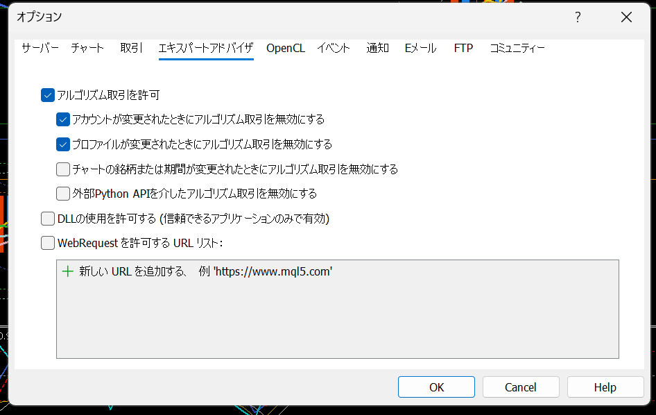

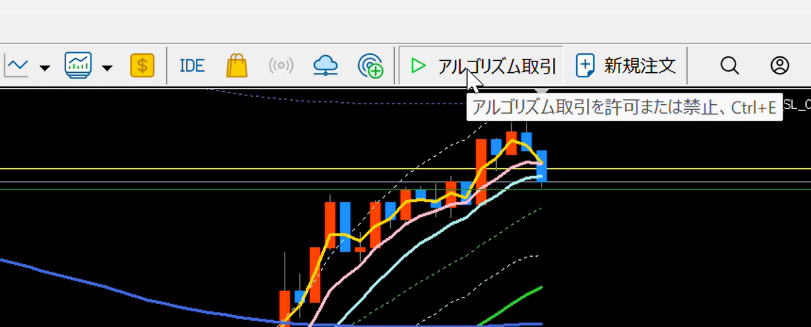