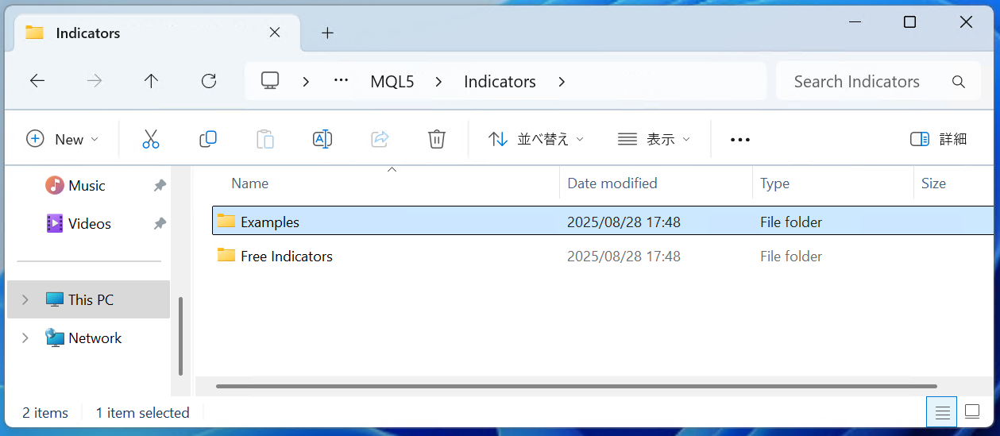

<small>ver2025.08.28</small>
# インジケーターのインストール

インジケーターのインストール方法を説明します。

- 注意. このマニュアルはWindows11ユーザーが対象です。
    - Windows10ユーザーはダウンロードフォルダの開き方が異なります。それ以外は同じように使えます。
- 注意. このマニュアルはMacユーザーには対応していません。
- 注意. このマニュアルでは例として「KJStyle_KJLine.ex5」のインストールを行います。 
    - 他のインジケータをインストールする場合は「KJStyle_KJLine.ex5」の部分を「tma centered bands arr.ex5」のように読み替えれば同じように使えます。

## 手順1. ダウンロードフォルダを開く
1. 全てのアプリケーションとウィンドを閉じる
2. タスクバーの「エクスプローラー」をクリック
3. 左ペインの「ダウンロード」をクリック
4. 「KJStyle_KJLine.ex5」があることを確認
5. ファイル名の先頭のアイコンを見てzipファイルであることを確認
    - ファスナーが付いているフォルダのアイコンです。

*2.*   
*3.*   
*5.*   

## 手順2. ダウンロードしたzipファイルを開く（解凍する）
1. ファイルの更新日時が新しいことを確認する
    - 古いファイルがダウンロードフォルダにある場合、新しいファイルが「KJStyle_KJLine.ex5 (1)」のような名前で保存されます。新しい方が対象です。
2. ダウンロードしたファイルをダブルクリック
3. フォルダの中に「KJStyle_KJLine」があることを確認
4. ファイル名の先頭のアイコンを見てEAファイルであることを確認
    - 歯車とチェックマークが組み合わさったようなアイコンです。

*1.*   
*3.*   
*5.* 

## 手順3. MT5のインジケーターフォルダを開く
1. MT5を起動する
2. メニューから「ファイル(F)」＞「データフォルダを開く(D)」
3. 次の順にフォルダを開く「MQL5」＞「Indicators」＞「Examples」

*2.* 

*3.*   
*3.*    
*3.* 

## 手順4. インジケーターファイルをインジケーターフォルダにコピーする
1. 手順2.で開いたフォルダを左に、手順3.で開いたフォルダを右にして並べる
2. 左のフォルダの「KJStyle_KJLine」をドラッグして右のフォルダにドロップする

*2.* 

## 手順5. MT5を再起動する
1. MT5を終了する
1. MT5を起動する

## 手順6. ナビゲータを表示
1. メニューから「表示」＞「ナビゲータ」
2. 左ペインに表示されたナビゲータから「指標」＞「Examples」
    - それぞれダブルクリックします。
3. 「KJStyle_KJLine」があることを確認
    - 名前順になっていますので下の方までスクロールして探してください。

*1.* 
*2.* 

*3.* 

## 手順7. インジケーターをチャートに設定
1. インジケータを設定したいチャートを前面に表示
2. ナビゲータにある「KJStyle_Auto_SL_02」をドラッグしてインジケータを設定したいチャートウィンドウにドロップ
3. 表示されたダイアログの「インプット」タブをクリック
4. 各種パラメータを調整して「OK」ボタンをクリック

*2*   
*3* 
