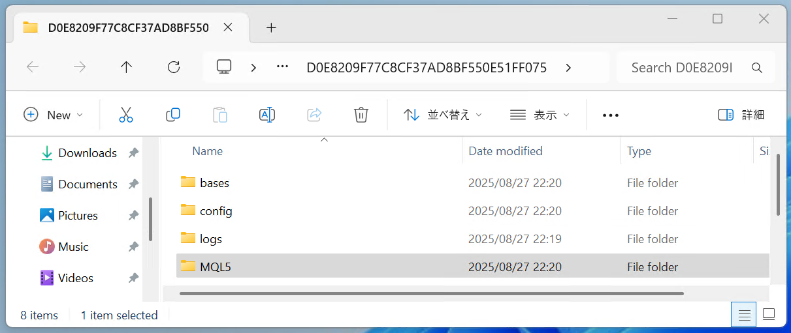

<small>ver2025.08.30</small>
# テンプレートのインストールと設定

テンプレートのインストールと設定方法を説明します。

- 注意. このマニュアルはWindows11ユーザーが対象です。
    - Windows10ユーザーはダウンロードフォルダの開き方が異なります。それ以外は同じように使えます。
- 注意. このマニュアルはMacユーザーには対応していません。
- 注意. このマニュアルでは例として「KJ STYLE M1」のインストールを行います。 
    - 他のテンプレートのインストールは「KJ STYLE M1」の部分を読み替えれば同じように使えます。

## 手順1. ダウンロードフォルダを開く
1. 全てのアプリケーションとウィンドを閉じる
2. タスクバーの「エクスプローラー」をクリック
3. 左ペインの「ダウンロード」をクリック
4. 「KJ STYLE M1」があることを確認
5. ファイル名の先頭のアイコンを見てzipファイルであることを確認
    - ファスナーが付いているフォルダのアイコンです。

*2.*   
*3.*   
*5.*   

## 手順2. ダウンロードしたzipファイルを開く（解凍する）
1. ファイルの更新日時が新しいことを確認する
    - 古いファイルがダウンロードフォルダにある場合、新しいファイルが「KJ STYLE M1 (1)」のような名前で保存されます。新しい方が対象です。
2. ダウンロードしたファイルをダブルクリック
3. フォルダの中に「KJ STYLE M1.tpl」があることを確認
4. ファイル名の先頭のアイコンを見てEAファイルであることを確認
    - 右隅が折れている白い紙のアイコンです。

*1.*   
*3.*   
*5.* 

## 手順3. MT5のテンプレートフォルダを開く
1. MT5を起動する
2. メニューから「ファイル(F)」＞「データフォルダを開く(D)」
3. 次の順にフォルダを開く「MQL5」＞「Profiles」＞「Templates」

*2.* 

*3.*   
*3.*    
*3.* 

## 手順4. テンプレートファイルをテンプレートフォルダにコピーする
1. 手順2.で開いたフォルダを左に、手順3.で開いたフォルダを右にして並べる
2. 左のフォルダの「KJ STYLE M1 (1)」をドラッグして右のフォルダにドロップする

*2.* 

## 手順5. 全ての時間足のテンプレートファイルをコピーする

「手順1.～手順4.」を繰り返して以下の7つの全ての時間足のテンプレートファイルをテンプレートフォルダにコピーして下さい。

- KJ STYLE M1
- KJ STYLE M5
- KJ STYLE M15
- KJ STYLE H1
- KJ STYLE M4
- KJ STYLE H12
- KJ STYLE D1

## 手順6. MT5を再起動する
1. MT5を終了する
1. MT5を起動する

## 手順7. テンプレートの適用
1. 1分足チャートを前面に表示
2. チャート上のどこでもよいので、何もない黒い部分を右クリック
3. コンテキストメニューから「テンプレート」＞「KJ STYLE M1」

*3.* 

## 手順8. 全ての時間足チャートにテンプレートを適用

「手順7.」を7つの全ての時間足チャートに適用してください。  
ウィンドウ名はチャートウィンドウの左上隅に表示されています。　  
下の表を見て各時間足チャートに対応するテンプレートを選択してください。

|時間足|ウィンドウ名|テンプレート|
|----|-----|----|
|1分足|XAUUSD,M1|KJ STYLE M1|
|5分足|XAUUSD,M5|KJ STYLE M5|
|15分足|XAUUSD,M15|KJ STYLE M15|
|1時間足|XAUUSD,H1|KJ STYLE H1|
|4時間足|XAUUSD,H4|KJ STYLE H4|
|12時間足|XAUUSD,H12|KJ STYLE H12|
|日足|XAUUSD,D1|KJ STYLE D1|

